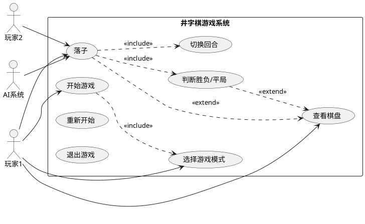

# 软件工程大作业：基于 MVC 架构的命令行井字棋游戏

---

**姓名**：苏怡萌  
**学号**：U202411889  
**班级**：水电2401班  
**日期**：2026年7月  

**代码仓库**：[https://github.com/Tim-dog/Software-Engineering-Major-Assignment](https://github.com/Tim-dog/Software-Engineering-Major-Assignment)

---

## 目录

1. [需求描述](#1-需求描述)
2. [系统设计](#2-系统设计)
3. [UML 建模](#3-uml-建模)
   - [3.1 用例图](#31-用例图)
   - [3.2 类图](#32-类图)
   - [3.3 序列图](#33-序列图)
4. [模块划分与类职责](#4-模块划分与类职责)
5. [游戏运行流程](#5-游戏运行流程)
6. [代码运行截图](#6-代码运行截图)
7. [项目结构](#7-项目结构)

---

## 1. 需求描述

本项目要求使用 C++ 语言设计并实现一个**命令行版井字棋游戏**，采用经典的 3×3 棋盘：
- 两名玩家轮流在棋盘上落子
- 任意一方率先在横向、纵向或对角线上形成连续三个相同棋子即获胜
- 如果棋盘被填满且无人获胜，则游戏判定为平局

**架构要求**：采用 **MVC（Model-View-Controller）** 架构进行设计与实现。

**功能要求**：
- 支持**双人对战**模式
- 支持**人机对战**模式（AI 自动选择第一个可落子的空格）
- 玩家通过命令行输入棋盘的行号和列号完成落子

**运行环境**：Windows + Visual Studio，C++20 标准。

---

## 2. 系统设计

### 2.1 MVC 架构划分

```
┌─────────────────────────────────────────────────────┐
│                   GameController                     │
│                  (Controller 层)                      │
│              控制游戏流程、读取输入                     │
└────────────┬──────────────────────┬─────────────────┘
             │                      │
    ┌────────▼────────┐    ┌───────▼────────┐
    │      Game        │    │   BoardView     │
    │   (Model 层)     │    │   (View 层)     │
    │  游戏核心逻辑     │    │  命令行界面显示  │
    └────────┬────────┘    └─────────────────┘
             │
    ┌────────┼────────┐
    │        │         │
┌───▼──┐ ┌──▼───┐ ┌──▼───┐
│Board │ │Player│ │Config │
│棋盘   │ │玩家   │ │配置    │
└──────┘ └──────┘ └──────┘
```

| 层次 | 类 | 职责 |
|------|-----|------|
| **Model** | `Board` | 棋盘状态、落子、判满 |
| **Model** | `Player` / `HumanPlayer` / `AIPlayer` | 玩家抽象、人类输入、AI 决策 |
| **Model** | `Game` | 游戏核心逻辑、胜负判断、回合切换 |
| **View** | `BoardView` | 绘制棋盘、显示游戏状态 |
| **Controller** | `GameController` | 游戏主循环、协调 View 和 Model |

### 2.2 关键设计决策

- **玩家 X 始终由人类控制**：在人机模式下，AI 固定为玩家 O，简化设计
- **简单 AI 策略**：从左到右、从上到下扫描第一个空格子，不需要复杂的博弈算法
- **输入校验**：`HumanPlayer::play()` 循环等待合法输入，支持格式错误、越界、占位三种异常处理
- **游戏结束状态**：`gameOver_` + `draw_` + `winner_` 三个标志完整覆盖胜负/平局/进行中三种状态

---

## 3. UML 建模

### 3.1 用例图


> **图 3-1**：用例图。玩家 1 负责开始游戏、选择模式和落子；玩家 2 或 AI 负责落子。落子操作包含胜负判断和回合切换。

### 3.2 类图

![类图（MVC架构）](http://www.plantuml.com/plantuml/png/hLRFQnD15BxlNp4Wn8tj5ekt44Dhj3M74g4bzbOckqCpP7SspCmcnDgB80WUF8cWuCMpXz9BiT2_fad_3T_Cx8_PpRPLiR3DplVUc_UzDz-RP4j8p6KIXUZcx7BnxSfvY9x-uH-uNl_wlFZvPVdZu_BYOldX4_BGtg3x3pivOapP17CS8J_4GcnBoUamaQJdnsoVlY7eSTLb9sPIMpOtdL8gjFp-zVhYoa8Smf88TKaOxaii2Jfn47eHJUGSFW_XwJkdZl7PnH7PYmFZyZA9C1i8_L4ijtlAkvHGHOHeSVREpgb9ecSnve7UpKF7d0P7BOGvn_Es-PzpMaTFEke1npKJv3RrEoU2IBVPGjEO1XgPXDWdUvYFNHxFMeWokOxyE4pV8Z2qYbeXS1Z7eGuy9bBXDM5DAqAxKg7xK--QRqX5ZmaQa7lTTX98cq7GFJmKacDVcfD4hq8y9rntwO4kuAZAntYurUAoidGtLeeuoTASgfxDtQ5gQmieCY5DZniGCy6KjnLtU3gAdE6aJziYjcOZzKJ-FibshvGXM_wlxPMQK-r5857eQgPlZUcz0DJRQ6IaIZm4oAgrCFHh39YQ1PWozXht4yu9axdHFXaFpIXZDV0niEjFjI4LZuS2ZcT7bfXK1QwgfYZcja41OQIJbDROoCV0PhSg7F1uhHckcgZOJKcwPOa_1vvkPTeKEOLPNTUuRkAXibZjR9Ii_TkikKQQHSUDCS9Zo3AzRnhz4V77QNbtN1PYHgK_AdBfhbOllW4biplkFMqsqbR7wAhppRIhUjAmJqjvcEEgrtZ9KT5Dn5qRWWIXh8EuEyBSLQ_bEds0LyhfmbSAZyCG1hAsA9N2yZd9HPjEbbvFeUXig5G3SjKMaVNwJPXhqnzX5eJa8E7irlOltf_Vd5_QFCtNZUTrBDccLqmjs7xhUQMPjl5ye1rzaSG0cQiYNzgHEPY7QKIbpVMV8mKHfzBKHx23xcKDNlJKAVIriM4Ie1PgjnD1EfsAqVIai3hsrLxdaD_AjT5RX0NmSydv3G)

> **图 3-2**：类图（MVC 架构）。Model 层包含 `Board`、`Player`（及其子类 `HumanPlayer`、`AIPlayer`）和 `Game`；View 层为 `BoardView`；Controller 层为 `GameController`。`Player` 为抽象类，使用多态实现人类与 AI 的差异化落子。

### 3.3 序列图


> **图 3-3**：序列图（双人对战）。展示游戏主循环的完整消息流：`GameController` 驱动 `BoardView` 绘制界面，接收玩家输入，调用 `Game::makeMove()` 更新状态，循环直到游戏结束。

---

## 4. 模块划分与类职责

### 4.1 Model 层

#### Board（棋盘类）
- **职责**：维护 3×3 棋盘状态，提供落子、查询、判满等原子操作
- **关键方法**：
  - `placeMark(row, col, mark)` — 在指定位置落子，返回是否成功
  - `getCell(row, col)` — 获取指定格子的棋子状态
  - `isEmpty(row, col)` / `isInside(row, col)` — 边界和空位检查
  - `isFull()` — 判断棋盘是否已满（用于平局判断）

#### Player / HumanPlayer / AIPlayer（玩家类族）
- **职责**：抽象玩家行为，通过多态支持人类输入和 AI 决策
- **设计模式**：策略模式 — `Player` 为抽象基类，`play()` 为纯虚函数
- `HumanPlayer::play()` — 循环读取命令行输入，校验格式/范围/占用后返回坐标
- `AIPlayer::play()` — 从左到右、从上到下扫描首个空格子

#### Game（游戏核心类）
- **职责**：管理游戏状态机，协调 Board 和 Player，判断胜负和平局
- **关键方法**：
  - `makeMove(row, col)` — 执行一步落子的完整流程（落子→判胜→判平→切换回合）
  - `checkWinner(mark)` — 检查 3 行、3 列、2 条对角线是否三连
  - `switchPlayer()` — 在 X 和 O 之间切换当前玩家

### 4.2 View 层

#### BoardView（视图类）
- **职责**：在命令行中渲染棋盘、当前玩家信息、游戏结果
- **关键方法**：
  - `draw(game)` — 绘制完整界面（棋盘 + 状态）
  - `drawBoard(board)` — 绘制 3×3 网格棋盘
  - `drawStatus(game)` — 显示当前回合或游戏结果
  - `cellToChar(cell)` — 将 `CellState` 枚举转换为显示字符

### 4.3 Controller 层

#### GameController（控制器类）
- **职责**：驱动游戏主循环，协调 View 和 Model 的交互
- **关键方法**：
  - `run()` — 游戏主循环：画界面 → 处理回合 → 检查结束
  - `handleTurn()` — 根据当前模式和玩家选择合适的 Player 对象，调用 `play()` 获取坐标，调用 `makeMove()` 执行落子

### 4.4 配置

#### Config.h
- `BOARD_SIZE = 3` — 棋盘大小常量
- `CellState` 枚举 — `Empty`, `X`, `O`
- `GameMode` 枚举 — `HumanVsHuman`, `HumanVsAI`

### 4.5 类之间的关系

```
GameController ◆── Game           (组合：Controller 拥有 Game)
GameController ◆── BoardView      (组合：Controller 拥有 View)
Game ◆── Board                    (组合：Game 拥有 Board)
Game ◇── HumanPlayer              (聚合：Game 拥有两个 HumanPlayer 和一个 AIPlayer)
Player <|── HumanPlayer           (继承：HumanPlayer 是 Player 的子类)
Player <|── AIPlayer              (继承：AIPlayer 是 Player 的子类)
BoardView ..> Game                (依赖：View 读取 Game 状态)
BoardView ..> Board               (依赖：View 读取 Board 状态)
HumanPlayer ..> Board             (依赖：玩家读取 Board 选择落子位置)
AIPlayer ..> Board                (依赖：AI 读取 Board 选择落子位置)
```

---

## 5. 游戏运行流程

```
┌──────────────┐
│  程序启动     │
└──────┬───────┘
       ▼
┌──────────────┐
│ 选择游戏模式  │
│ 1=双人 2=人机│
└──────┬───────┘
       ▼
┌──────────────┐
│ GameController│
│   .run()      │
└──────┬───────┘
       ▼
  ┌────────────────────────────────┐
  │         游戏主循环               │
  │                                 │
  │  ┌───────────┐                  │
  │  │ draw()     │  绘制棋盘和状态   │
  │  └─────┬─────┘                  │
  │        ▼                        │
  │  ┌───────────┐                  │
  │  │handleTurn()│ 选择Player→play()│
  │  └─────┬─────┘                  │
  │        ▼                        │
  │  ┌───────────┐                  │
  │  │ makeMove() │ 落子→判胜→判平   │
  │  └─────┬─────┘                  │
  │        ▼                        │
  │  isGameOver()? ──否──→ 继续循环  │
  │        │                        │
  └────────┼────────────────────────┘
           │ 是
           ▼
┌──────────────┐
│ draw()       │
│ 显示最终结果  │
└──────┬───────┘
       ▼
┌──────────────┐
│  等待按键退出 │
└──────────────┘
```

**流程说明**：
1. 程序启动，`main()` 设置 UTF-8 控制台编码，显示模式选择菜单
2. 用户选择 1（双人对战）或 2（人机对战）
3. `GameController` 初始化 `Game` 和 `BoardView` 对象
4. 进入主循环 `while (!game_.isGameOver())`：
   - `BoardView::draw()` 绘制当前棋盘和状态
   - `GameController::handleTurn()` 根据当前玩家和模式选择 `HumanPlayer` 或 `AIPlayer`，调用其 `play()` 获取落子坐标
   - `Game::makeMove(row, col)` 执行落子、判断胜负、判断平局、切换回合
5. 游戏结束后显示最终结果（X 胜 / O 胜 / 平局）
6. 按回车键退出程序

---

## 6. 代码运行截图

> ⚠️ **请在 Visual Studio 或 VSCode 中编译运行后，将运行截图插入此位置。**  
> 需要截取以下场景：
> - 模式选择界面
> - 双人对战进行中的棋盘
> - 获胜结果界面
> - 平局结果界面
> - 人机对战界面

### 6.1 编译截图

*（在此处插入 Visual Studio 编译成功的截图）*

### 6.2 运行截图

*（在此处插入游戏运行的截图，包括模式选择、双人对战、人机对战、获胜、平局等场景）*

---

## 7. 项目结构

```
ProjectMorpion/
├── main.cpp                 # 程序入口，模式选择 + UTF-8 控制台设置
├── Config.h                 # 全局配置（BOARD_SIZE、CellState、GameMode 枚举）
├── Board.h / Board.cpp      # Model: 棋盘状态管理
├── Player.h / Player.cpp    # Model: 玩家抽象类 + HumanPlayer + AIPlayer
├── Game.h / Game.cpp        # Model: 游戏核心逻辑（makeMove、checkWinner、switchPlayer）
├── BoardView.h / BoardView.cpp  # View: 命令行界面渲染
├── GameController.h / GameController.cpp  # Controller: 游戏主循环和回合控制
├── ProjectMorpion.slnx      # Visual Studio 解决方案文件
├── ProjectMorpion.vcxproj   # Visual Studio 项目文件
├── .gitignore               # Git 忽略规则
├── README.md                # 项目说明文档
├── docs/                    # UML 设计文档
│   ├── use_case.puml        # 用例图（PlantUML 源码）
│   ├── class_diagram.puml   # 类图（PlantUML 源码）
│   └── sequence_diagram.puml # 序列图（PlantUML 源码）
└── scripts/
    └── generate_uml_urls.py # PlantUML URL 生成脚本
```

---

## 附录：PlantUML 源码

### 用例图源码（use_case.puml）



### 类图源码（class_diagram.puml）

*完整源码见 `docs/class_diagram.puml`，此处因篇幅省略。类图包含 MVC 三层全部 6 个类及 2 个枚举类型，展示了组合（◆）、聚合（◇）、继承（<|--）和依赖（..>）四种关系。*

### 序列图源码（sequence_diagram.puml）

*完整源码见 `docs/sequence_diagram.puml`，展示了双人对战模式下从游戏初始化到结束的完整消息序列，包含玩家 X、玩家 O、GameController、BoardView、Game、Board 六个参与者的交互。*

---

**— 报告完 —**
